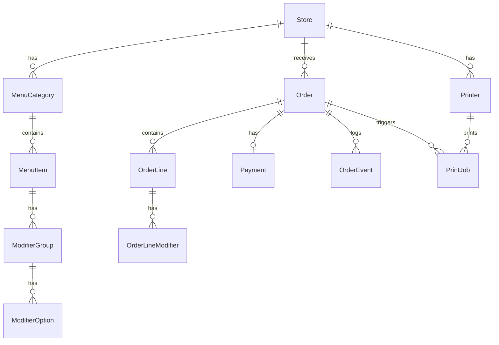

# Этап 1: доменная модель

Соответствует [order-flow.md](order-flow.md): статусы заказа без `accepted` / `in_progress` — после оплаты сразу `paid`, затем бариста переводит в `ready`.

---

## 1. Диаграмма сущностей (логическая)

---

## 2. Сущности

### Store (точка)

| Поле | Тип | Описание |
|------|-----|----------|
| id | UUID PK | |
| slug | string unique | URL: `/s/{slug}` |
| name | string | Название для гостя |
| qr_token_secret | string (internal) | Для проверки `?t=` в QR (HMAC/JWT) |
| accepting_orders | boolean | Приём заказов вкл/выкл |
| created_at | timestamptz | |

### MenuCategory

| Поле | Тип |
|------|-----|
| id | UUID PK |
| store_id | UUID FK → Store |
| sort_order | int |
| name | string |

### MenuItem

| Поле | Тип |
|------|-----|
| id | UUID PK |
| category_id | UUID FK |
| name | string |
| description | text nullable |
| image_url | text nullable |
| price_cents | int |
| is_available | boolean |
| sort_order | int |

### ModifierGroup (например «Молоко»)

| Поле | Тип |
|------|-----|
| id | UUID PK |
| menu_item_id | UUID FK |
| name | string |
| min_select | int (0 или 1) |
| max_select | int |
| sort_order | int |

### ModifierOption

| Поле | Тип |
|------|-----|
| id | UUID PK |
| group_id | UUID FK |
| name | string |
| price_delta_cents | int (0+) |
| sort_order | int |

### Order

| Поле | Тип |
|------|-----|
| id | UUID PK |
| store_id | UUID FK |
| status | enum см. ниже |
| public_number | int | Номер для гостя в рамках точки и дня (001–999) |
| public_number_date | date | Дата, к которой привязан номер (смена дня по TZ точки) |
| guest_email | text nullable | Для чека и уведомления |
| guest_push_subscription | jsonb nullable | Web Push (позже) |
| subtotal_cents | int |
| total_cents | int |
| currency | char(3) default RUB |
| idempotency_key | string unique nullable | Ключ для повторного «Оплатить» |
| payment_provider_id | string nullable | id платежа у провайдера |
| created_at | timestamptz |
| updated_at | timestamptz |
| ready_at | timestamptz nullable |

**Статусы Order:** `draft` | `payment_pending` | `paid` | `ready` | `picked_up` | `cancelled` | `refunded`

Переходы:

- `draft` → `payment_pending` (создание платежа)
- `payment_pending` → `paid` (webhook успешной оплаты) или обратно в `draft` при отмене оплаты
- `paid` → `ready` (бариста «Готово») — триггер печати + уведомление
- `paid` → `cancelled` (отмена с возвратом)
- `ready` → `picked_up` (опционально)
- `paid` / `ready` → `refunded` (возврат)

### OrderLine

| Поле | Тип |
|------|-----|
| id | UUID PK |
| order_id | UUID FK |
| menu_item_id | UUID FK |
| menu_item_name_snapshot | string | На момент заказа |
| unit_price_cents | int |
| quantity | int |
| line_total_cents | int |

### OrderLineModifier

| Поле | Тип |
|------|-----|
| id | UUID PK |
| order_line_id | UUID FK |
| modifier_option_id | UUID FK nullable |
| name_snapshot | string |
| price_delta_cents | int |

### Payment (опционально отдельная таблица или поля в Order)

Для аудита и нескольких попыток оплаты удобно отдельная таблица:

| Поле | Тип |
|------|-----|
| id | UUID PK |
| order_id | UUID FK |
| provider | string (evotor / yookassa / …) |
| provider_payment_id | string |
| amount_cents | int |
| status | pending / succeeded / failed |
| raw_payload | jsonb nullable |
| created_at | timestamptz |

### OrderEvent (аудит)

| Поле | Тип |
|------|-----|
| id | bigserial PK |
| order_id | UUID FK |
| event_type | string |
| payload | jsonb nullable |
| actor | string nullable (system / barista_user_id) |
| created_at | timestamptz |

### Printer

| Поле | Тип |
|------|-----|
| id | UUID PK |
| store_id | UUID FK |
| name | string |
| api_key_hash | string | Агент авторизуется по ключу |
| last_seen_at | timestamptz nullable |

### PrintJob

| Поле | Тип |
|------|-----|
| id | UUID PK |
| order_id | UUID FK |
| printer_id | UUID FK nullable |
| status | pending / printing / done / failed |
| payload | jsonb (текст чека / ESC-POS blob позже) |
| attempts | int |
| created_at | timestamptz |

### BaristaUser (MVP: простая авторизака)

| Поле | Тип |
|------|-----|
| id | UUID PK |
| email | string unique |
| password_hash | string |
| store_ids | UUID[] или таблица user_store |

---

## 3. Правило `public_number`

- Уникальность: пара **(store_id, public_number_date, public_number)**.
- При переходе заказа в `paid` (webhook): выделить следующий свободный номер **в рамках точки и календарного дня** в часовом поясе точки (пока можно хранить `store.timezone`).
- Диапазон: например **1–999** в день; при исчерпании — расширить до 4 цифр или сброс с префиксом (уточнить позже).
- Номер показывается гостю сразу после оплаты и на чеке при `ready`.

---

## 4. Индексы (минимум)

- `orders(store_id, status, created_at)` — очередь бариста.
- `orders(store_id, public_number_date, public_number)` unique.
- `menu_items(category_id, sort_order)`.
- `print_jobs(status, created_at)` для агента (polling).

---

Физическая схема SQL: [../../backend/schema.sql](../../backend/schema.sql).
