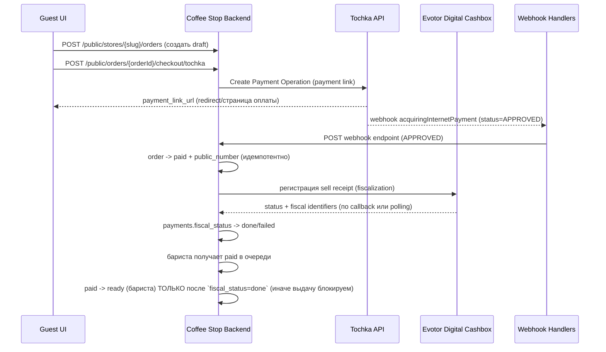

# Готовый продукт: Tochka API → `paid` → фискализация в Evotor → печать/выдача

## Цель
Сделать поток, где гость выполняет только 2 действия:
1. `Заказ` (формирование корзины/кастомизация)
2. `Оплата по Tochka` (платёжная ссылка)

А в кофейне система автоматически:
1. получает оплаченный заказ через webhook Tochka (`APPROVED`)
2. переводит заказ в `paid`
3. запускает фискализацию и печать чека через Evotor (фискальный контур)
4. выставляет заказ на выдачу (бариста `paid -> ready`)

Функционально это соответствует вашей модели статусов:
`draft -> payment_pending -> paid -> ready`.

## Принцип “истины”
- Истина по оплате — webhook Tochka `acquiringInternetPayment` с `status=APPROVED`.
- Истина по фискальному чеку — ответ Evotor digital cashbox (статус/идентификатор чека).

## Почему именно так (и что мы избегаем)
- Если использовать режим Tochka **With Receipt**, чек будет формироваться/фискализироваться в контуре партнёра Точки.
- Чтобы чек именно печатался/фиксировался в Evotor, используем Tochka **без фискализации чека** и делаем чек в Evotor после подтверждения оплаты.

Справка по режимам Tochka:
- “Без фискализации” — `Create Payment Operation`
- “С фискализацией” — `Create Payment Operation With Receipt`

Источники:
- Tochka “Платёжные ссылки”: https://developers.tochka.com/docs/tochka-api/opisanie-metodov/platyozhnye-ssylki
- Tochka webhook тип `acquiringInternetPayment` и статусы: https://developers.tochka.com/docs/tochka-api/opisanie-metodov/vebhuki
- Evotor “Цифровая касса” (план Б, фискализация после оплаты): `docs/requirements/payments/evotor-digital-cashbox.md`

## Основные сущности
- `orders`: хранит статус, public_number, готовность/выдачу
- `payments`: привязка к заказу, provider operationId, статусы оплаты и фискализации
- `print_jobs`: внутренний “номер на стойку” (можно печатать отдельно от фискального чека)

## Последовательность (sequence)

## Что гость видит
- Страница оплаты: создаём платёжную ссылку и переводим гостя на неё.
- После оплаты гость попадает обратно на “статус заказа” и видит `paid` (polling уже реализован).
- Если фискализация/печать ещё не завершены — выдача и переход `paid -> ready` блокируются до `fiscal_status=done`.

## Что кофейня видит
- “Платёж прошёл”: заказ появляется в бариста-очереди (`paid`).
- “Фискализация”: мы храним `fiscal_status` в БД и логируем ошибки/ретраи.
- “Печать”: фискальный чек печатается средствами Evotor цифровой кассы; внутренний талон на стойку — отдельная сущность печати (как сейчас).

